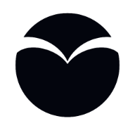

# HUB C3 Platform & Dashboard

<p align="center">  </p> <p align="center"> <a href="https://github.com/ZYLIM0702/c3-dashboard/issues">  </a> <a href="https://github.com/ZYLIM0702/c3-dashboard/stargazers">  </a> <a href="LICENSE">  </a> </p>
<p align="center">               </p>


> **Humanitarian Unified Backbone (HUB) Command & Control Center**  
> Next-generation open-source platform for resilient, real-time, and secure field operations.

---

## UM Technothon 2025 — Team All Good

**Group Members:**  
Lim Zi Yang, Liang Xinyu, Tang Jun Jie, Leow Jing Bang

---

## Abstract

Earthquakes and floods devastate communities, causing immense loss of life and economic damage. The Humanitarian Unified Backbone (HUB) is a modular, open-source ecosystem that unites sensors, wearables, drones, and mobile apps into a resilient, real-time network. Designed with stakeholder input, HUB ensures rapid alerts, seamless coordination, and enhanced situational awareness for governments, responders, and communities. Leveraging AI-driven analytics and a self-healing mesh network, HUB operates even in compromised environments—saving lives, curbing losses, and fostering resilience in disaster-prone regions.

---

## Introduction

Natural disasters strike with devastating force, exposing critical gaps in communication, early warning, and real-time data integration. HUB addresses these challenges with a resilient edge-to-cloud network, connecting field devices to a centralized Command & Control Center (C3) for real-time data flow and coordination—even when infrastructure is compromised.

---

## Problem Statement

How can disaster response systems overcome the lack of data integration, real-time monitoring, communication breakdowns, and open-source accessibility to prevent catastrophic human, economic, and social tolls from earthquakes and floods?

---

## Objectives

1. **Develop a sustainable, modular, open-source ecosystem** for rapid, cost-effective disaster response.
2. **Leverage AI-driven analytics and distributed sensor networks** for real-time, actionable alerts.
3. **Design user-friendly, multi-language interfaces and adaptable hardware** for diverse populations.
4. **Fabricate a self-healing communication mesh** using LoRa, GSM, and other protocols.
5. **Enhance real-time situational awareness** through integrated tracking and hazard monitoring.

---

## Scalable Architecture Overview

### Full Edge-to-Cloud, Modular, and Open-Source Design

- **Edge Ingestion Layer:** Field devices (helmets, nodes, drones, wearables) → Edge Cluster → MQTT Brokers / Regional Kafka → Central pipelines.
- **Data & ML Pipeline:** Apache Kafka → Stream processing (Flink/Spark) → Batch processing (MLflow) → Model serving (KServe).
- **API / Microservices:** Unified REST/OpenAPI layer mediating all database and ML access (FastAPI, Supabase, scalable containers).
- **SDK Layer:** Device-side libraries (C/C++, Python, Node.js, Flutter, ROS) for device registration, message serialization, and protocol translation (MQTT/LoRaWAN/HTTP).
- **C3 Dashboard & Mobile App:** Next.js dashboard, Flutter/React Native mobile clients for operators and civilians.
- **Observability & Ops:** Prometheus → Grafana dashboards + ELK/EFK for logs and metrics.

**[Insert Figure: Full Architecture Diagram for Command & Control Center (C3)]**

---

## Mobile App

The HUB C3 ecosystem includes a cross-platform mobile app for field operators and civilians.

- **Repository:** [hub-app (GitHub)](https://github.com/ZYLIM0702/hub-app)
- **Features:**
  - Real-time alerts and notifications
  - Device registration and QR onboarding
  - Peer-to-peer LoRa messaging
  - Live video streaming from field devices
  - Map view for situational awareness
  - Multi-language support
- **Tech Stack:** Flutter (Dart), supporting Android and iOS
- **Integration:** Connects to the C3 backend and dashboard for seamless data flow and operations.

See the [hub-app repository](https://github.com/ZYLIM0702/hub-app) for source code, setup, and documentation.

---

##ML/AI Analytics Pipeline & Integration

- **Data Collection:** Real-time telemetry from all field devices (sensors, wearables, drones, helmets) ingested via edge and cloud brokers.
- **Stream & Batch Processing:** Data flows through Kafka, processed in real-time (Flink/Spark) and batch (MLflow, custom models).
- **Model Training & Serving:** ML models (anomaly detection, risk scoring, event prediction) are trained and versioned (MLflow), served via KServe or FastAPI endpoints.
- **Dashboard Integration:**
  - ML analytics (e.g., risk scores, anomaly flags, predictions) are displayed in the dashboard (see Devices page: ML Analytics column, summary card).
  - Backend exposes `/ml/analytics` endpoints for device- and fleet-level analytics.
  - SDKs and dashboard fetch and display ML results in real time.
- **Scalability:** The pipeline is designed for future scaling to millions of devices and multi-region deployments, with modular microservices and cloud-native orchestration.

**[Insert Figure: ML/AI Analytics Pipeline Diagram]**

---

## Deployment Scenarios

**Urban Earthquake Response:**  
- Pre-event: SEH helmets, ground/marine nodes, drones, and C3 dashboard deployed.
- During event: Early warning via LoRa, live drone imaging, SEH telemetry, and C3-coordinated SAR.
- Post-event: Data analytics, after-action review, and community recovery.

**Flash Flood Response:**  
- Pre-event: Marine buoys and ground nodes deployed, flood models running in C3.
- During event: Real-time alerts, drone imaging, and evacuation coordination.
- Post-event: Data-driven model refinement and community support.

---

## Innovation

- **Universal SDK & Protocol Layer:** Open telemetry interface (MQTT, REST, LoRa) for instant onboarding of any device.
- **Modular Hardware:** Self-registration, auto-discovery, and real-time streaming across mixed connectivity.
- **Cloud-Native C3 Center:** Scalable microservices, real-time analytics, and AI-enhanced predictions.
- **Self-Healing Mesh:** LoRa and GSM routing for communication continuity during infrastructure collapse.

---

## Monorepo Structure

```
c3-dashboard/
│
├── app/           # Next.js dashboard (frontend)
├── c3-sdk/        # Multi-language SDKs
│   ├── python/
│   ├── cpp/
│   ├── nodejs/
│   ├── flutter/
│   ├── ros/
│   └── backend/   # FastAPI + Supabase backend
├── components/    # UI components
├── services/      # Supabase and backend service code
├── public/        # Static assets
├── styles/        # Tailwind CSS
└── [hub-app/](https://github.com/ZYLIM0702/hub-app)   # Mobile app (Flutter, separate repo)
```

---

## Quick Start

### 1. Clone the Repository

```bash
git clone https://github.com/ZYLIM0702/c3-dashboard.git
cd c3-dashboard
```

### 2. Install Dependencies

```bash
pnpm install  # or npm/yarn/bun
```

### 3. Configure Environment

Create `.env.local` for the dashboard and set up Supabase keys.

### 4. Run the Dashboard

```bash
pnpm dev
```

### 5. Run the Backend

```bash
cd c3-sdk/backend
pip install -r requirements.txt
export SUPABASE_URL=...
export SUPABASE_KEY=...
uvicorn main:app --reload
```

---

## SDKs & Integrations

- **Python, C++, Node.js, Flutter, ROS**: See each SDK’s README for installation and usage.
- **Video Streaming**: Register and stream live video from field devices.
- **LoRa Messaging**: Peer-to-peer chat for field teams, even without internet.
- **Device Management & Telemetry**: Register, monitor, and control devices in real time.
- **ML Analytics**: Fetch and display risk scores, anomaly detection, and predictions for each device.

---

## Deployment

- **Frontend:** Vercel (recommended), Docker, or any Node.js host
- **Backend:** Docker, server, or cloud (see backend/README.md)
- **CI/CD:** GitHub Actions for automated build and deploy

---

## Documentation

- [SDKs & API Reference](./c3-sdk/)
- [Backend API](./c3-sdk/backend/README.md)
- [Supabase Schema](./c3-sdk/backend/README.md)
- [Flutter SDK](./c3-sdk/flutter/README.md)
- [Mobile App (hub-app)](https://github.com/ZYLIM0702/hub-app)

---

## Contributing

We welcome contributions! Please see [CONTRIBUTING.md](CONTRIBUTING.md) for guidelines.

---

**Built for resilience. Powered by open source. Ready for the field.**

---

### Appendix: Implementation Plan & Scaling

- **Phase 1:** Foundation & Core Infrastructure (SDKs, mesh routing, MVP hardware)
- **Phase 2:** Pilot Deployments & Device Prototyping (field kits, alpha hardware)
- **Phase 3:** Scaling & Productization (multi-device, fleet management, open hardware)
- **Phase 4:** Ecosystem Expansion & Interoperability (global mesh, plugin registry, open hardware certification)

See proposal for full details on phases, risk mitigation, and value to all stakeholders.
